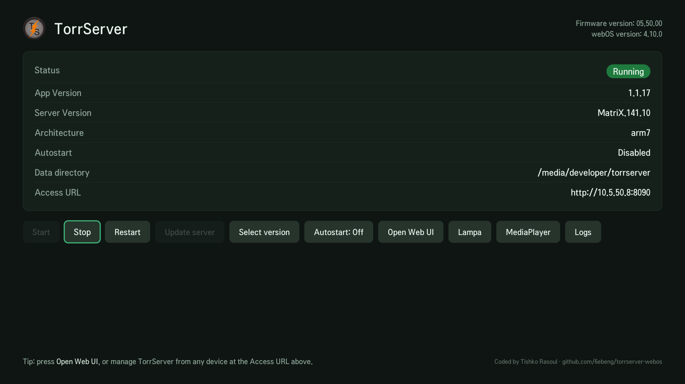

# TorrServer for webOS

Run [TorrServer](https://github.com/YouROK/TorrServer) on your LG TV. A webOS homebrew app (`.ipk`) with a small launcher UI plus a background service that downloads, runs and supervises the official TorrServer build. Manage it from any device at `http://<tv-ip>:8090`.

> Requires a **rooted** webOS TV with the Homebrew Channel.



## Build

```powershell
npm run build
```

## Deploy

```powershell
npm run deploy                                                          # build + install + elevate
powershell -ExecutionPolicy Bypass -File scripts/deploy.ps1 -Autostart  # also enable boot autostart
```

## Usage

1. Launch **TorrServer** on the TV and press **Start** (first launch downloads ~70 MB).
2. Manage from any device at `http://<tv-ip>:8090`.

Buttons: Start / Stop / Restart / Update / Select version / Autostart / Open Web UI / Lampa / MediaPlayer / Logs.

The header shows the TV's **Firmware version** and **webOS version**. The **Status** row is a coloured chip (green when running, grey when stopped), and the footer shows a context tip for the current state.

The **Lampa** shortcut appears only when the Lampa app (`com.lampa.tv`) is installed. **MediaPlayer** opens the TV's built-in media player (Photo/Video on webOS &lt; 6, MediaPlayer on webOS 6+). **Open Web UI** launches the TV browser at the TorrServer address.

## Notes

- Autostart is **on by default** — TorrServer launches at boot after the first successful start. Toggle it anytime with the in-app **Autostart** button (your choice is then remembered). Root is detected through the Homebrew Channel, so it works on rooted TVs across webOS versions (including webOS 4.x).
- TorrServer binds all interfaces on port `8090` — keep it on a trusted LAN.
- The matching CPU architecture (`amd64`, `386`, `arm5`, `arm7`, `arm64`) is detected and downloaded at runtime, so the `.ipk` stays small and always tracks the latest release.
- Data is stored in the first writable + exec-capable path among `/media/developer/torrserver`, `/home/root/torrserver`, `/media/internal/.torrserver`, `/tmp/torrserver`. Download scratch files are removed after each install to save space.

## Layout

```
appinfo/   TV web app (tile + UI)
service/   node service + torrserver-run.sh supervisor
scripts/   build / deploy (PowerShell)
```

## Architecture

```
┌─────────────┐   Luna bus    ┌──────────────────────┐   exec    ┌────────────────────┐
│  Web UI     │ ───────────►  │  JS service          │ ───────►  │  torrserver-run.sh │
│ (appinfo/)  │  status/start │ (com.torrserver.     │  detached │  supervisor        │
│ d-pad nav,  │ ◄───────────  │  app.service)        │ ◄───────  │  arch detect,      │
│ status poll │   JSON state  │  thin Luna wrapper   │   JSON    │  download, pidfile │
└─────────────┘               └──────────────────────┘           └─────────┬──────────┘
                                                                            │ downloads
                                                                            ▼
                                                          github.com/YouROK/TorrServer releases
                                                          (TorrServer-linux-<arch>, port 8090)
```

- **Web UI** never blocks: it fires actions and follows progress by polling `status` every 2 s.
- **Service** is a thin, stateless Luna wrapper; all lifecycle logic lives in the supervisor script.
- **Supervisor** owns architecture detection, runtime download (curl → wget → Node fallback), the state machine (`state` file) and process supervision (pid file).

## Credits

[TorrServer](https://github.com/YouROK/TorrServer) (GPL-3.0, fetched at runtime). Wrapper: MIT. Coded by **Tishko Rasoul** — [github.com/6ebeng/torrserver-webos](https://github.com/6ebeng/torrserver-webos)
