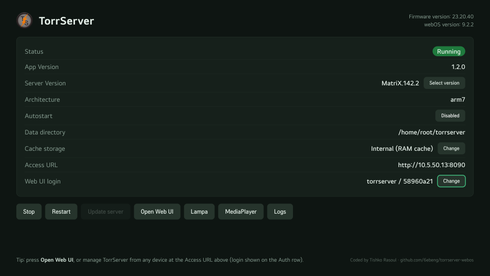

# TorrServer for webOS

Run [TorrServer](https://github.com/YouROK/TorrServer) on your LG TV. A webOS homebrew app (`.ipk`) with a small launcher UI plus a background service that runs and supervises the official TorrServer build, which is **bundled inside the `.ipk`** (nothing is downloaded at runtime). Manage it from any device at `http://<tv-ip>:8090` (HTTP Basic Auth — the credentials are shown in the app).

> Works on both **rooted** and **unrooted** TVs. Install in **Developer Mode** (unrooted) or via the **Homebrew Channel** (rooted). Boot **autostart** additionally requires root (the Homebrew Channel); everything else works either way.



## Build

```powershell
npm run build
```

## Deploy

```powershell
npm run deploy                                                          # build + install
powershell -ExecutionPolicy Bypass -File scripts/deploy.ps1 -Autostart  # also enable boot autostart
```

## Usage

1. Launch **TorrServer** on the TV and press **Start**. The bundled TorrServer binary is installed locally and started.
2. Manage from any device at `http://<tv-ip>:8090`, signing in with the **Web UI login** credentials shown in the app.

Each control sits inline with the value it changes:

- **Start/Stop** is one toggle button (green **Start** when stopped, **Stop** when running), next to **Restart** in the actions bar.
- **Web UI login** row → the Basic Auth username/password for the web interface and API.
- **Autostart** row → an **Enabled/Disabled** toggle (**off by default**; enabling it writes a boot hook, which requires a rooted TV with the Homebrew Channel). Hidden, with an explanation, on non-rooted TVs.
- **Cache storage** row → **Change** (move the torrent cache to a USB drive).
- The actions bar also has **Open Web UI**, **MediaPlayer** and **Logs** (plus **Lampa** when the Lampa app is installed).

The header shows the TV's **Firmware version** and **webOS version**. The **Status** row is a coloured chip (green when running, grey when stopped), and the footer shows a context tip for the current state. **Logs** open in a modal overlay (D-pad up/down scrolls). **MediaPlayer** opens the TV's built-in media player (Photo/Video on webOS &lt; 6, MediaPlayer on webOS 6+). **Open Web UI** launches the TV browser at the TorrServer address.

## Notes

- Autostart is **off by default**. Enabling it (the **Enabled/Disabled** button on the Autostart row) writes a boot hook so TorrServer launches at boot; disabling removes it. Writing the hook requires root, which the app gets from the Homebrew Channel on rooted TVs (verified on webOS **4.x** and **9.x**); on non-rooted TVs the toggle is hidden.
- Updating the app is seamless: reinstalling the `.ipk` over an existing install (webOS Dev Manager or Homebrew Channel) **does not require a reboot**. The background service runs on-demand and cleanly de-registers from the Luna bus when idle, so the new version starts responding right away. The bundled TorrServer binary is updated along with the app.
- TorrServer binds port `8090` and requires **HTTP Basic Auth** (the credentials shown in the app) on every request, so it is not open to the whole network.
- The official 32-bit ARM (`arm7`) TorrServer build is **bundled in the `.ipk`** — webOS userspace is 32-bit ARM on every TV, so a single binary covers all sets and nothing is downloaded at runtime. The exact binary is pinned and SHA256-verified at build time (see `scripts/build.ps1`).
- Data is stored in the first writable + exec-capable path among `/media/developer/torrserver`, `/home/root/torrserver`, `/media/internal/.torrserver`, `/tmp/torrserver`.
- **Cache storage:** by default the torrent cache lives in a small in-RAM buffer. Plug in a USB drive and use the **Change** button on the Cache storage row to move the torrent cache/downloads onto it (handy for large files and to spare internal storage). The TorrServer program and its database always stay on internal storage — the USB drive only holds the cache, in a dedicated `torrserver-cache` sub-folder. If the drive is removed, TorrServer automatically falls back to the in-RAM cache.
- Your TorrServer settings are **preserved across restarts**: the app only patches the network/cache keys it manages and never rewrites the rest of `settings.json`, so anything you configure in the web UI is kept.

## Layout

```
appinfo/   TV web app (tile + UI)
service/   node service + torrserver-run.sh supervisor
scripts/   build / deploy (PowerShell)
```

## Architecture

```
┌─────────────┐   Luna bus    ┌──────────────────────┐   exec    ┌────────────────────┐
│  Web UI     │ ───────────►  │  JS service          │ ───────►  │  torrserver-run.sh │
│ (appinfo/)  │  status/start │ (com.torrserver.     │  detached │  supervisor        │
│ d-pad nav,  │ ◄───────────  │  app.service)        │ ◄───────  │  install bundled,  │
│ status poll │   JSON state  │  thin Luna wrapper   │   JSON    │  pidfile, settings │
└─────────────┘               └──────────────────────┘           └─────────┬──────────┘
                                                                            │ runs (bundled in .ipk)
                                                                            ▼
                                                                  TorrServer-linux-arm7
                                                                  (port 8090, HTTP Basic Auth)
```

- **Web UI** never blocks: it fires actions and follows progress by polling `status` every 2 s.
- **Service** is a thin, stateless Luna wrapper; all lifecycle logic lives in the supervisor script. It runs **on-demand** — alive while the app is polling, then it idle-exits a few seconds after the app closes and de-registers from the Luna bus, so app updates never leave a stale registration behind.
- **Supervisor** installs the bundled binary into the data dir, owns the state machine (`state` file), process supervision (pid file), HTTP-auth credentials (`accs.db`) and the settings merge. Long-running work is detached (`setsid`), so TorrServer keeps running after the service idle-exits.

## Development

The app targets the oldest runtimes webOS ships, so both sides are written to run everywhere:

- **Service** (`service/`) runs on **Node.js 0.12 (ES5)** on older TVs — no `let`/`const`, arrow functions, or ES2017 trailing commas in calls.
- **Web UI** (`appinfo/`) runs in the TV WebView, which is **Chromium 53** on webOS 4.x — the same trailing-comma restriction applies.

A committed `.prettierrc.json` pins `trailingComma: "es5"` so formatting can't reintroduce a call/param trailing comma (which would break parsing on those old runtimes).

## Credits

[TorrServer](https://github.com/YouROK/TorrServer) (GPL-3.0, fetched at runtime). Wrapper: MIT. Coded by **Tishko Rasoul** — [github.com/6ebeng/torrserver-webos](https://github.com/6ebeng/torrserver-webos)
